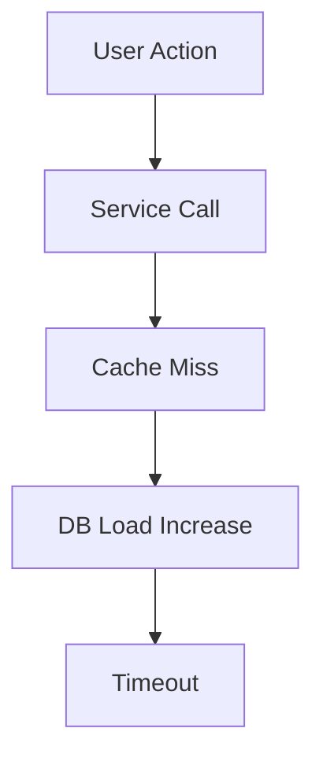

# Causal Flow Mapping Protocol (CFM)

**USE THIS TO:** Unpack cause → effect chains, debug issues, explain system dynamics.

## Process

1. **Pin the effect:**
   - What changed? (behavior, metric, output)
   - Where? (component, service, function)
   - When? (timeline, trigger events)
   - Scope? (all users, specific conditions)

2. **Sketch a causal DAG:**
   - Nodes = states, events, conditions
   - Edges = hypothesized causal influence
   - Use Mermaid diagram for visualization:

3. **Annotate evidence:**
   - Mark each edge with evidence type:
     * 🟢 Strong (logs, traces, metrics)
     * 🟡 Weak (correlation, timing)
     * 🔴 Unknown (hypothesis)
   - Note confounders (alternative explanations)

4. **Plan discriminating tests:**
   - Feature toggles to isolate components
   - Tracepoints to capture state
   - Controlled inputs to reproduce
   - Time-boxed probes (max 30 min each)

5. **Run probes & prune:**
   - Execute tests in order of expected information gain
   - Keep only edges supported by evidence
   - Iterate until minimal sufficient explanation found

## Example Investigation

**Effect:** API latency increased from 50ms to 500ms

**Initial DAG:**
- Deployment → Cache invalidation → DB queries ↑ → Latency ↑
- Deployment → Query plan change → Full scans → Latency ↑

**Evidence gathering:**
- Check cache hit rates (logs) 🟢
- Check query execution plans (database) 🟢
- Check deployment timing (git history) 🟢

**Result:** Query plan regression confirmed, cache unaffected.
