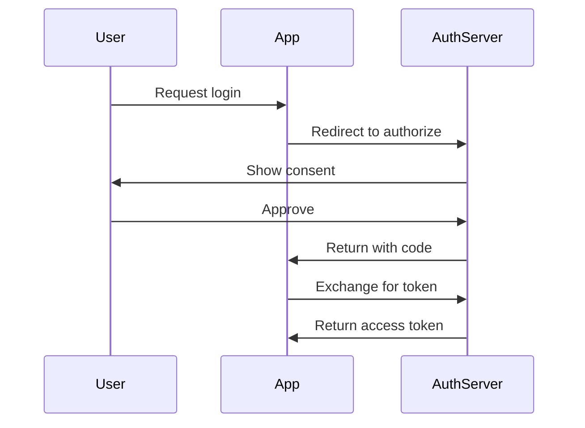
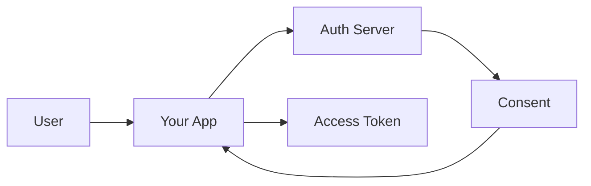

# Document Architecture & Tool Integration Plan

## Current Slug Implementation Analysis

### What We Have Now

**GitHub-Style Slugs via `github-slugger`:**
- Converts headings to URL-safe slugs: `"API & Documentation"` → `"api--documentation"`
- Deterministic and reversible (mostly)
- Handles duplicates with counters when needed
- Already integrated in:
  - `src/slug.ts` - Core slug generation
  - `src/parse.ts` - Heading extraction with slugs
  - `src/sections.ts` - Section CRUD operations using slugs

**Current Usage Pattern:**
```typescript
// Each heading gets a unique slug
const heading = {
  title: "Authentication",
  slug: "authentication",  // Generated via titleToSlug()
  depth: 2,
  parentIndex: 0
}

// Sections are addressed by slug
readSection(markdown, "authentication")
replaceSectionBody(markdown, "authentication", newContent)
```

## Proposed Document Architecture

### 1. Document Identity System

**Three-Level Addressing:**
```
Document Path: /api/authentication
Section Slug: oauth-setup
Full Address: /api/authentication#oauth-setup
```

**Benefits:**
- Documents have unique paths (filesystem-like)
- Sections have unique slugs within documents
- Full addresses are globally unique
- Natural for both humans and LLMs

### 2. Smart Cache System

```typescript
interface DocumentCache {
  // Document metadata
  path: string;                    // /api/authentication
  title: string;                    // "API Authentication Guide"
  lastModified: Date;              // File mtime
  contentHash: string;             // SHA-256 of content
  
  // Parsed structure (cached)
  headings: Heading[];             // All headings with slugs
  toc: TocNode[];                  // Hierarchical TOC
  slugIndex: Map<string, number>;  // slug -> heading index
  
  // Content sections (lazy-loaded)
  sections: Map<string, string>;   // slug -> content
  
  // Metadata
  wordCount: number;
  linkCount: number;
  codeBlockCount: number;
  lastAccessed: Date;
}
```

**Cache Invalidation:**
- Watch files with `fs.watch()` or `chokidar`
- Invalidate on mtime change
- Lazy rebuild on next access
- LRU eviction for memory management

### 3. Enhanced Document Features

#### A. Table of Contents with Anchor Links

```markdown
# API Authentication Guide

## Table of Contents
- [Overview](#overview)
- [OAuth 2.0 Setup](#oauth-20-setup)
  - [Client Registration](#client-registration)
  - [Authorization Flow](#authorization-flow)
- [JWT Tokens](#jwt-tokens)
  - [Token Structure](#token-structure)
  - [Validation](#validation)
- [Security Best Practices](#security-best-practices)
```

#### B. Cross-Document References

```markdown
See also: [Database Schema](/architecture/database#user-tables)
Related: [Error Handling Guide](/guides/error-handling)
```

#### C. Rich Markdown Features

```markdown
## Authentication Methods

### OAuth 2.0 {#oauth-setup}

> **Note:** This requires client registration first.

#### Prerequisites
- [ ] API credentials configured
- [ ] Redirect URIs whitelisted
- [ ] Scopes defined

#### Implementation

```typescript
const oauth = new OAuth2Client({
  clientId: process.env.CLIENT_ID,
  clientSecret: process.env.CLIENT_SECRET,
  redirectUri: 'https://example.com/callback'
});
```

:::warning Security Notice
Never expose client secrets in frontend code!
:::

#### Flow Diagram



#### Quick Reference

| Parameter | Required | Description |
|-----------|----------|-------------|
| `client_id` | ✅ | Your application ID |
| `scope` | ✅ | Requested permissions |
| `state` | ✅ | CSRF protection token |
| `redirect_uri` | ✅ | Callback URL |

<details>
<summary>Advanced Options</summary>

Additional parameters for fine-tuning:
- `prompt`: Control re-authentication
- `access_type`: Offline access
- `include_granted_scopes`: Incremental auth

</details>
```

### 4. Tool Integration Strategy

#### Document Management Tools

**`create_document`**
```typescript
{
  path: "/api/authentication",
  title: "API Authentication Guide",
  template: "api-reference",
  features: {
    toc: true,              // Auto-generate TOC
    anchors: true,          // Add heading anchors
    codeHighlight: true,    // Syntax highlighting
    mermaid: true,          // Diagram support
    searchIndex: true       // Include in search
  }
}
```

**`read_document`**
```typescript
{
  path: "/api/authentication",
  options: {
    includeToc: true,       // Return parsed TOC
    includeMetadata: true,  // Word count, etc.
    resolveLinks: true,     // Resolve cross-refs
    format: "markdown"      // or "html", "json"
  }
}
```

**`update_section`**
```typescript
{
  path: "/api/authentication",
  slug: "oauth-setup",      // Target section
  content: "Updated content",
  options: {
    preserveAnchors: true,  // Keep custom anchors
    updateToc: true,        // Regenerate TOC
    validateLinks: true     // Check cross-refs
  }
}
```

**`search_documents`**
```typescript
{
  query: "oauth token",
  options: {
    searchIn: ["title", "headings", "content", "code"],
    fuzzy: true,            // Fuzzy matching
    boost: {
      title: 2.0,          // Weight multipliers
      headings: 1.5,
      code: 1.2
    },
    highlight: true,        // Return snippets
    groupByDocument: true   // Group results
  }
}
```

### 5. Implementation Phases

#### Phase 1: Core Infrastructure
- [x] Slug generation (github-slugger)
- [x] Basic section CRUD
- [ ] Document cache system
- [ ] File watching
- [ ] Path-based document storage

#### Phase 2: Enhanced Parsing
- [ ] TOC generation with anchors
- [ ] Cross-reference resolution
- [ ] Metadata extraction
- [ ] Code block analysis

#### Phase 3: Rich Features
- [ ] Mermaid diagram support
- [ ] Table formatting
- [ ] Callout/admonition blocks
- [ ] Collapsible sections

#### Phase 4: Search & Discovery
- [ ] Full-text search index
- [ ] Fuzzy matching
- [ ] Semantic search preparation
- [ ] Link graph analysis

### 6. Testing Strategy

#### Enhanced Test Document

```markdown
# Comprehensive API Documentation

## Table of Contents
[Auto-generated TOC here]

## Overview {#intro}

This document demonstrates all supported markdown features for comprehensive testing.

### Quick Start

Get started in under 5 minutes with our [authentication guide](#authentication).

## Authentication {#auth}

### OAuth 2.0 Setup {#oauth-setup}

> **Prerequisites:** You'll need API credentials from the [developer console](https://console.example.com).

#### Step 1: Client Registration {#oauth-client-reg}

Register your application to obtain credentials:

```bash
curl -X POST https://api.example.com/oauth/register \
  -H "Content-Type: application/json" \
  -d '{
    "name": "My App",
    "redirect_uris": ["https://myapp.com/callback"]
  }'
```

#### Step 2: Authorization Flow {#oauth-flow}



### JWT Tokens {#jwt}

:::info Token Lifetime
- Access tokens: 1 hour
- Refresh tokens: 30 days
:::

#### Token Structure {#jwt-structure}

| Part | Description | Example |
|------|-------------|---------|
| Header | Algorithm & type | `{"alg":"RS256","typ":"JWT"}` |
| Payload | Claims | `{"sub":"123","exp":1234567890}` |
| Signature | Verification | `[base64 signature]` |

<details>
<summary>Decode Example</summary>

```javascript
const jwt = require('jsonwebtoken');
const decoded = jwt.decode(token);
console.log(decoded);
```

</details>

## API Endpoints {#endpoints}

### Users API {#users-api}

#### GET /users {#get-users}

Retrieve user list with pagination.

**Parameters:**
- `page` (integer): Page number
- `limit` (integer): Items per page
- `sort` (string): Sort field

**Example:**
```http
GET /api/v1/users?page=1&limit=20&sort=created_at
Authorization: Bearer YOUR_TOKEN
```

**Response:**
```json
{
  "users": [...],
  "pagination": {
    "page": 1,
    "total": 100
  }
}
```

## Error Handling {#errors}

See our [comprehensive error guide](/guides/error-handling#http-codes) for details.

### Common Errors {#common-errors}

- `401 Unauthorized` - Check your [authentication](#auth)
- `429 Rate Limited` - See [rate limits](#rate-limits)
- `500 Server Error` - Check [status page](https://status.example.com)

## Rate Limits {#rate-limits}

Default limits per endpoint:

| Endpoint | Limit | Window |
|----------|-------|--------|
| `/users` | 100 | 1 minute |
| `/auth/*` | 20 | 1 minute |
| `/search` | 50 | 1 minute |

## Appendix {#appendix}

### Glossary {#glossary}

- **OAuth**: Open Authorization protocol
- **JWT**: JSON Web Token
- **CORS**: Cross-Origin Resource Sharing

### Related Documents

- [OpenAPI Specification](/specs/openapi.yaml)
- [Postman Collection](/tools/postman-collection.json)
- [SDK Documentation](/sdks/javascript)

---

*Last updated: 2025-01-06*
*Version: 2.1.0*
```

This test document includes:
- ✅ Table of contents with anchors
- ✅ Custom heading IDs
- ✅ Cross-references (internal & external)
- ✅ Code blocks (multiple languages)
- ✅ Tables with formatting
- ✅ Mermaid diagrams
- ✅ Callout blocks (info, warning)
- ✅ Collapsible details
- ✅ Lists (ordered, unordered, task)
- ✅ Blockquotes
- ✅ Inline code
- ✅ Metadata (version, date)

## Summary

The plan leverages our existing slug system as the foundation for a robust document management system with:

1. **Path + Slug addressing** for global uniqueness
2. **Smart caching** with file watching
3. **Rich markdown features** for better UX
4. **Comprehensive tooling** for CRUD operations
5. **Full-text search** with slug-based indexing

This architecture scales well, provides excellent performance through caching, and creates a professional documentation system that rivals tools like GitBook or Docusaurus.