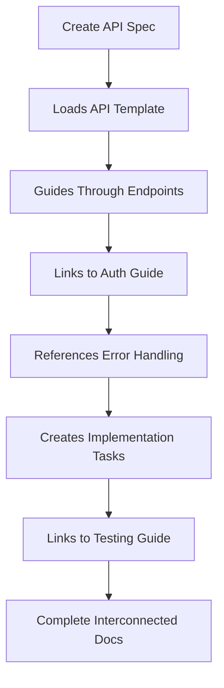

# Spec-Docs MCP Server

A Model Context Protocol (MCP) server that enables LLMs to manage interconnected specification documents through intelligent, progressive discovery workflows.

## The Problem

Traditional documentation management requires manual coordination between related documents, leading to:
- **Fragmented instructions** scattered across multiple markdown files
- **Missing context** when specifications reference other documents
- **Inconsistent implementations** due to incomplete information loading
- **Manual coordination** between documentation, specs, and implementation guides

## The Solution

Spec-Docs MCP provides a **linked document ecosystem** where:
- Specifications automatically **load related documents** into context
- **Progressive discovery** guides users through complex workflows step-by-step
- **Linked references** ensure all relevant information is available during tasks
- **Structured templates** create consistent, interconnected documentation

Think of it as a more powerful replacement for manual markdown management, where documents understand their relationships and guide development workflows intelligently.

## Status

🚧 **Active Development** - Core MCP infrastructure complete with progressive discovery patterns implemented.

## Key Features

### 🔗 **Linked Document Management**
- **Automatic Context Loading** - Referenced documents load automatically when needed
- **Cross-Document Linking** - Specifications connect to implementation guides, troubleshooting docs, and related specs
- **Dependency Tracking** - Documents understand their relationships and load prerequisites
- **Smart Navigation** - Follow document chains without manual file hunting

### 🎯 **Progressive Discovery Workflows**
- **Guided Creation** - Step-by-step document creation with best practices built-in
- **Context-Aware Schemas** - Tool parameters revealed progressively to conserve context
- **Intelligent Defaults** - Templates and examples provided at each step
- **Error Recovery** - Helpful guidance instead of cryptic error messages

### 📋 **Specification-Driven Development**
- **Living Documentation** - Specs that update and guide implementation
- **Template Consistency** - Standard formats for API specs, implementation guides, architecture docs
- **Task Integration** - Link tasks directly to specification sections
- **Automatic Validation** - Ensure implementations match specifications

### 🛠 **Available MCP Tools**

**Document Management:**
- `create_document` - Progressive document creation with guided workflows ✅
- `list_documents` - Browse and discover existing documentation ✅
- `search_documents` - Find relevant content across the entire knowledge base ✅
- `edit_section` - Update specific sections while preserving document structure ✅
- `insert_section` - Add new sections with automatic hierarchy management ✅
- `archive_document` - Safely archive outdated documentation ✅

**Task & Reference Management:**
- `add_task` - Link implementation tasks to specification sections 🚧
- `complete_task` - Mark tasks complete with implementation notes 🚧
- `view_document` - Inspect document structure and metadata 🚧
- `remove_section` - Delete sections with safety checks 🚧

## Use Cases

### **For Development Teams**
- **API Documentation** - Create comprehensive, linked API specifications with implementation guides
- **Architecture Planning** - Document system design with connected component specifications
- **Feature Development** - Link user stories to technical specs to implementation guides

### **For Technical Writers**
- **Documentation Ecosystems** - Build interconnected documentation that guides readers through complex topics
- **Standard Templates** - Ensure consistent structure across all documentation types
- **Content Validation** - Verify that implementation guides match current specifications

### **For LLM Integration**
- **Intelligent Assistance** - AI assistants that understand document relationships and load relevant context
- **Guided Workflows** - Step-by-step processes that prevent incomplete implementations
- **Context-Aware Responses** - AI responses that consider all related documentation

## Example Workflow



## Architecture

### Progressive Discovery Pattern
Tools reveal parameters gradually, guiding users through complex workflows:
- **Stage 0**: Discovery - Show available options
- **Stage 1**: Configuration - Gather specific requirements
- **Stage 2**: Creation - Execute with full context

### Modular MCP Design
```
src/
├── session/           # Session state management with singleton patterns
├── tools/
│   ├── schemas/       # Centralized schema definitions with examples
│   ├── implementations/ # Individual tool logic
│   └── registry.ts    # Dynamic tool registration
├── server/            # MCP protocol handling
└── shared/            # Common utilities and helpers
```

### Document Linking System
- **Automatic Context Loading** - Referenced documents load when needed
- **Smart Templates** - Consistent structure across document types
- **Cross-Reference Validation** - Ensure linked documents exist and are current
- **Progressive Enhancement** - Start simple, add complexity as needed

## Installation & Development

```bash
# Install and build
pnpm install && pnpm build

# Start MCP inspector for testing
pnpm inspector:dev

# Run quality gates
pnpm test:run && pnpm lint && pnpm typecheck
```

## Testing Progressive Discovery

1. **Start Inspector**: `pnpm inspector:dev`
2. **Call Tool**: Use `create_document` with empty parameters
3. **Manual Refresh**: Pull down or click refresh in tool list
4. **Observe Evolution**: See schema expand with new parameters
5. **Continue Flow**: Call with next stage parameters

## Technical Foundation

**Built With:**
- **TypeScript** - Strict mode for type safety
- **MCP SDK** - Full protocol compliance
- **Unified/Remark** - AST-based markdown processing
- **Progressive Schemas** - Context-conserving parameter discovery
- **Session Management** - Singleton pattern for state persistence

**Quality Standards:**
- Comprehensive test coverage with Vitest
- Zero-tolerance linting with ESLint
- Strict TypeScript configuration
- Automated quality gates

## Roadmap

**Near Term:**
- Complete remaining MCP tool implementations
- Enhanced document linking and validation
- Template system for common document types

**Future Vision:**
- **Smart Context Loading** - AI-driven relevant document discovery
- **Workflow Automation** - Complete development process guidance
- **Integration Ecosystem** - Connect with popular development tools
- **Team Collaboration** - Multi-user document coordination

## Contributing

This project is building the foundation for **intelligent documentation management**. We're creating tools that understand context, guide workflows, and eliminate the friction of managing complex, interconnected specifications.

Contributions, ideas, and feedback welcome as we shape the future of specification-driven development!

## License

MIT - See LICENSE file for details

---

*Building documentation systems that think.*