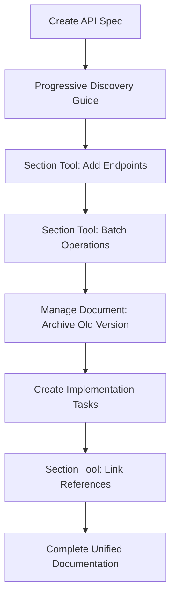

# Spec-Docs MCP Server

A Model Context Protocol (MCP) server that enables LLMs to manage interconnected specification documents through intelligent, progressive discovery workflows.

## The Problem

Traditional documentation management requires manual coordination between related documents, leading to:
- **Fragmented instructions** scattered across multiple markdown files
- **Missing context** when specifications reference other documents
- **Inconsistent implementations** due to incomplete information loading
- **Manual coordination** between documentation, specs, and implementation guides

## The Solution

Spec-Docs MCP provides a **linked document ecosystem** where:
- Specifications automatically **load related documents** into context
- **Progressive discovery** guides users through complex workflows step-by-step
- **Linked references** ensure all relevant information is available during tasks
- **Structured templates** create consistent, interconnected documentation

Think of it as a more powerful replacement for manual markdown management, where documents understand their relationships and guide development workflows intelligently.

## Status

✅ **Production Ready** - Core MCP infrastructure complete with unified tool architecture and progressive discovery patterns implemented.

## Key Features

### 🔗 **Advanced Document Linking System**
- **Cross-Document References** - Use `@/path/doc.md` to link between documents
- **Section-Specific Links** - Link directly to sections with `@/guides/setup.md#configuration`
- **Within-Document Links** - Reference local sections with `@#section-name`
- **Hierarchical Slugs** - Prevent naming conflicts with nested slug paths like `#api/authentication/jwt-tokens`
- **Automatic Context Loading** - Referenced documents load automatically with cycle detection
- **Smart Link Suggestions** - AI-powered recommendations based on content analysis
- **Link Validation & Health** - Comprehensive validation with health scoring and auto-fix suggestions

### 🎯 **Progressive Discovery Workflows**
- **Guided Creation** - Step-by-step document creation with best practices built-in
- **Context-Aware Schemas** - Tool parameters revealed progressively to conserve context
- **Intelligent Defaults** - Templates and examples provided at each step
- **Error Recovery** - Helpful guidance instead of cryptic error messages

### 📋 **Specification-Driven Development**
- **Living Documentation** - Specs that update and guide implementation
- **Template Consistency** - Standard formats for API specs, implementation guides, architecture docs
- **Task Integration** - Link tasks directly to specification sections
- **Automatic Validation** - Ensure implementations match specifications

### 🛠 **Available MCP Tools**

**Core Document Management:**
- `create_document` - Progressive document creation with smart link guidance ✅
- `browse_documents` - Unified browsing and searching with namespace awareness ✅
- `list_documents` - Browse and discover existing documentation ✅
- `search_documents` - Find relevant content across the entire knowledge base ✅

**Unified Section Operations:**
- `section` - Complete section management with intelligent link assistance ✅
  - Edit operations: `replace`, `append`, `prepend` with link validation
  - Create operations: `insert_before`, `insert_after`, `append_child` with automatic depth
  - Remove operations: `remove` with content recovery
  - Smart link suggestions based on content analysis
  - Batch support for multiple operations

**Unified Document Operations:**
- `manage_document` - Complete document management with batch support ✅
  - `archive` - Safe archival with audit trails
  - `delete` - Permanent deletion (requires confirmation)
  - `rename` - Update document titles
  - `move` - Relocate documents with path management
- `archive_document` - Legacy archive tool (use `manage_document` instead) ✅

**Enhanced Document Analysis:**
- `view_document` - Enhanced document inspection with namespace awareness and linked context loading ✅
  - Section-specific viewing with `document#section` syntax
  - Automatic linked document context loading with configurable depth (1-6)
  - Comprehensive document health metrics and link analysis
  - Hierarchical section navigation and metadata

**Task Management (Placeholder Tools):**
- `add_task` - Link implementation tasks to specification sections 🚧
- `complete_task` - Mark tasks complete with implementation notes 🚧
- `reopen_task` - Revert task completion status 🚧

## Use Cases

### **For Development Teams**
- **API Documentation** - Create comprehensive, linked API specifications with implementation guides
- **Architecture Planning** - Document system design with connected component specifications
- **Feature Development** - Link user stories to technical specs to implementation guides

### **For Technical Writers**
- **Documentation Ecosystems** - Build interconnected documentation that guides readers through complex topics
- **Standard Templates** - Ensure consistent structure across all documentation types
- **Content Validation** - Verify that implementation guides match current specifications

### **For LLM Integration**
- **Intelligent Assistance** - AI assistants that understand document relationships and load relevant context
- **Guided Workflows** - Step-by-step processes that prevent incomplete implementations
- **Context-Aware Responses** - AI responses that consider all related documentation

## Example Workflow



### Unified Tool Examples

```javascript
// Section tool - All operations in one
await section({
  document: "/api/user-service.md",
  section: "#authentication",
  content: "Updated auth flow...",
  operation: "replace"
});

// Batch section operations
await section([
  { document: "/api/spec.md", section: "#endpoints", content: "...", operation: "append" },
  { document: "/api/spec.md", section: "#new-feature", content: "...", operation: "insert_after", title: "New Feature" },
  { document: "/api/spec.md", section: "#deprecated", operation: "remove" }
]);

// Document management - All operations unified
await manage_document({
  operation: "archive",
  document: "/old-spec.md"
});
```

## Architecture

### Unified Tool Architecture
The server follows a "one tool, one purpose" philosophy with powerful, consolidated operations:

**Progressive Discovery Pattern:**
Tools reveal parameters gradually, guiding users through complex workflows:
- **Stage 0**: Discovery - Show available options
- **Stage 1**: Configuration - Gather specific requirements
- **Stage 2**: Creation - Execute with full context

**Unified Operations:**
- **`section` tool** - All section operations (create/edit/remove) with automatic depth calculation
- **`manage_document` tool** - All document operations (archive/delete/rename/move) with batch support
- **Batch Processing** - Multiple operations in a single call for efficiency

### Modular MCP Design
```
src/
├── session/           # Session state management with singleton patterns
├── tools/
│   ├── schemas/       # Centralized schema definitions with examples
│   ├── implementations/ # Individual tool logic
│   └── registry.ts    # Dynamic tool registration
├── server/            # MCP protocol handling
└── shared/            # Common utilities and helpers
```

### Document Linking System
- **Automatic Context Loading** - Referenced documents load when needed
- **Smart Templates** - Consistent structure across document types
- **Cross-Reference Validation** - Ensure linked documents exist and are current
- **Progressive Enhancement** - Start simple, add complexity as needed

## Installation & Development

```bash
# Install and build
pnpm install && pnpm build

# Start MCP inspector for testing
pnpm inspector:dev

# Run quality gates
pnpm test:run && pnpm lint && pnpm typecheck
```

## Testing Progressive Discovery

1. **Start Inspector**: `pnpm inspector:dev`
2. **Call Tool**: Use `create_document` with empty parameters
3. **Manual Refresh**: Pull down or click refresh in tool list
4. **Observe Evolution**: See schema expand with new parameters
5. **Continue Flow**: Call with next stage parameters

## Technical Foundation

**Built With:**
- **TypeScript** - Strict mode for type safety
- **MCP SDK** - Full protocol compliance
- **Unified/Remark** - AST-based markdown processing
- **Progressive Schemas** - Context-conserving parameter discovery
- **Session Management** - Singleton pattern for state persistence

**Quality Standards:**
- Comprehensive test coverage with Vitest
- Zero-tolerance linting with ESLint
- Strict TypeScript configuration
- Automated quality gates

## Roadmap

**Completed Major Features:**
- ✅ **Comprehensive Document Linking System** - Full `@` syntax support with cross-document and section links
- ✅ **Hierarchical Slug Architecture** - Prevents naming conflicts with nested paths
- ✅ **Smart Link Guidance** - AI-powered suggestions in document creation and editing
- ✅ **Link Validation & Health** - System-wide link health monitoring with auto-fix suggestions
- ✅ **Enhanced Tool Integration** - All core tools support the linking system

**Near Term:**
- Complete task management tool implementations (`add_task`, `complete_task`)
- Template system expansion for common document types
- Advanced batch operations across multiple documents

**Future Vision:**
- **Smart Context Loading** - AI-driven relevant document discovery
- **Workflow Automation** - Complete development process guidance
- **Integration Ecosystem** - Connect with popular development tools
- **Team Collaboration** - Multi-user document coordination
- **Advanced Batch Operations** - Cross-document operations and bulk management

## Contributing

This project is building the foundation for **intelligent documentation management**. We're creating tools that understand context, guide workflows, and eliminate the friction of managing complex, interconnected specifications.

Contributions, ideas, and feedback welcome as we shape the future of specification-driven development!

## License

MIT - See LICENSE file for details

---

*Building documentation systems that think.*