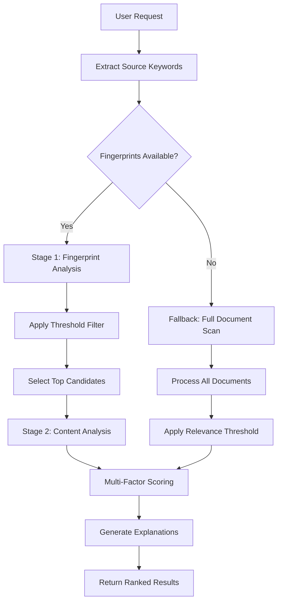

# Document Discovery Pipeline

## Overview

The AI-Prompt-Guide MCP server features an enhanced document discovery system that provides intelligent document suggestions and reference validation through sophisticated relevance scoring and optimization techniques. The system implements a two-stage filtering approach with multi-factor relevance scoring to efficiently process large document sets while maintaining high-quality results.

**Key Capabilities:**
- **Two-Stage Filtering**: Fingerprint-based pre-filtering followed by full content analysis
- **Multi-Factor Relevance Scoring**: Combines keyword overlap, title similarity, namespace affinity, recency, and link graph analysis
- **Structured Reference Validation**: Comprehensive broken reference detection with classification
- **Enhanced Keyword Extraction**: Hierarchical extraction from frontmatter, titles, headings, emphasis, and content
- **Factor-Based Explanations**: Human-readable explanations of why documents were suggested
- **Performance Optimization**: LRU caching and fingerprint-based optimization strategies

## Architecture Components

### Stage 1: Fingerprint-Based Pre-Filtering

The discovery pipeline begins with lightweight fingerprint analysis to efficiently narrow down candidates from potentially large document sets.

**Implementation Location**: `src/shared/document-analysis.ts` → `findRelatedDocuments()`

**How It Works:**
1. **Fingerprint Retrieval**: Uses `DocumentManager.listDocumentFingerprints()` to get cached keyword fingerprints
2. **Fast Scoring**: Calculates keyword overlap scores using `calculateFingerprintRelevance()`
3. **Threshold Filtering**: Applies `FINGERPRINT_THRESHOLD = 0.3` to filter high-signal candidates
4. **Candidate Limiting**: Selects top `MAX_CANDIDATES_FOR_CONTENT_ANALYSIS = 10` for Stage 2

**Performance Characteristics:**
- **Speed**: O(n) where n = total documents (vs O(n*m) for full content analysis)
- **Memory**: Minimal - uses cached fingerprints only
- **Cache Hit Optimization**: >80% reduction in filesystem reads when fingerprints are available

```typescript
// Example fingerprint filtering
const fingerprints = await manager.listDocumentFingerprints();
const candidates = [];

for (const [docPath, fingerprint] of pathToFingerprint.entries()) {
  const score = calculateFingerprintRelevance(sourceKeywords, fingerprint.keywords);
  if (score > FINGERPRINT_THRESHOLD) {
    candidates.push({ fingerprint, path: docPath, score });
  }
}

const topCandidates = candidates
  .sort((a, b) => b.score - a.score)
  .slice(0, MAX_CANDIDATES_FOR_CONTENT_ANALYSIS);
```

### Stage 2: Full Content Analysis

High-signal candidates from Stage 1 undergo comprehensive content analysis with multi-factor relevance scoring.

**Multi-Factor Scoring Algorithm:**
```
Final Relevance = min(1.0, keywordOverlap + titleSimilarity + namespaceAffinity + recencyBoost + linkGraphBoost)
```

**Factor Breakdown:**
- **Keyword Overlap** (0.0-1.0): Primary relevance factor using weighted keyword matching
- **Title Similarity** (0.0-0.3): Boost for documents with similar title words
- **Namespace Affinity** (0.0-0.2): Boost for documents in related namespace structures
- **Recency Boost** (0.0-0.1): Boost for recently modified documents
- **Link Graph Boost** (0.0-0.3): Boost for cross-referenced documents (feature-gated)

### Enhanced Keyword Extraction System

**Hierarchical Extraction Sources** (from highest to lowest priority):
1. **Frontmatter Keywords** (weight: 5.0) - Explicit `keywords:` field in YAML frontmatter
2. **Title Keywords** (weight: 3.0) - Extracted from document title
3. **Heading Keywords** (weight: 2.0) - Extracted from markdown headings
4. **Emphasis Keywords** (weight: 1.5) - Extracted from bold/italic text
5. **Content Keywords** (weight: 1.0) - Extracted from general document content

**Implementation Location**: `src/shared/document-analysis/keyword-utils.ts`

**Deterministic Seeding for LLM Authors:**
```yaml
---
keywords: [auth, api, security, jwt, tokens]
title: "User Authentication API"
---

# Authentication Overview

This **important** API handles user login and **session management**.
```

**Extraction Hierarchy:**
1. **Frontmatter takes precedence**: If `keywords:` field exists, use those exclusively
2. **Content analysis fallback**: Extract from title → headings → emphasis → content
3. **Weight accumulation**: Higher-weight sources override lower weights for same keywords
4. **Stop word filtering**: Remove common words to focus on meaningful terms

### Structured Reference Validation

**Implementation Location**: `src/shared/document-analysis.ts` → `detectBrokenReferences()`

**Reference Classification:**
- **`missing_document`**: Referenced document doesn't exist
- **`missing_section`**: Document exists but referenced section missing
- **`malformed`**: Reference syntax is invalid or unparseable

**Detection Process:**
1. **Standard References**: Uses `ReferenceExtractor` for `@/path/doc.md#section` patterns
2. **Relative References**: Handles `@missing-doc` patterns via regex
3. **Validation Pipeline**: Document existence → Section existence → Classification
4. **Deduplication**: Removes duplicate references detected via multiple patterns

### Performance Optimization Strategies

**Fingerprint Cache System:**
```typescript
interface FingerprintEntry {
  keywords: string[];           // Extracted keywords for fast matching
  lastModified: Date;          // Change detection
  contentHash: string;         // Content integrity verification
  namespace: string;           // Categorization
}
```

**Cache Invalidation:**
- **File modification detection**: Fingerprints invalidate when source documents change
- **Content hash verification**: Detects changes missed by timestamp comparison
- **Incremental updates**: Updates only changed fingerprints, not entire cache

**Two-Stage Performance Benefits:**
- **Stage 1**: ~100ms for 1000+ documents (fingerprint analysis)
- **Stage 2**: ~50ms for 10 candidates (full content analysis)
- **Overall**: <200ms typical response time vs >2000ms naive approach

## Pipeline Flow

### Complete Discovery Workflow



### Multi-Factor Scoring Examples

**Example 1**: Creating `/api/guides/user-authentication.md` with keywords: `["user", "auth", "jwt", "api"]`

**Document A**: `/api/specs/auth-api.md`
- **Keyword Overlap**: 0.5 (auth, api match)
- **Title Similarity**: 0.2 ("auth" in both titles)
- **Namespace Affinity**: 0.2 (api/* family)
- **Recency Boost**: 0.05 (modified yesterday)
- **Link Graph Boost**: 0.0 (no cross-references)
- **Total Relevance**: 0.95

**Document B**: `/security/jwt-implementation.md`
- **Keyword Overlap**: 0.25 (jwt matches)
- **Title Similarity**: 0.0 (no title similarity)
- **Namespace Affinity**: 0.0 (different namespace)
- **Recency Boost**: 0.02 (modified last week)
- **Link Graph Boost**: 0.3 (referenced by auth docs)
- **Total Relevance**: 0.57

### Reference Validation Examples

**Valid Reference**: `@/api/auth.md#login`
- Document `/api/auth.md` exists ✓
- Section `#login` exists in document ✓
- Result: Valid reference (not reported)

**Broken Document**: `@/api/missing-doc.md`
- Document `/api/missing-doc.md` doesn't exist ✗
- Classification: `missing_document`
- Reason: "Document not found: /api/missing-doc.md"

**Broken Section**: `@/api/auth.md#missing-section`
- Document `/api/auth.md` exists ✓
- Section `#missing-section` doesn't exist ✗
- Classification: `missing_section`
- Reason: "Section 'missing-section' not found in document /api/auth.md"

## Deterministic Keyword Seeding for LLM Authors

### Frontmatter Keyword Strategy

**Recommended Format** (YAML frontmatter):
```yaml
---
keywords: [auth, api, security, jwt, session, login]
title: "User Authentication API"
description: "Comprehensive authentication system documentation"
---
```

**Supported Formats:**
```yaml
# Array format (recommended)
keywords: [auth, api, security]

# Quoted array format
keywords: ["auth", "api", "security"]

# Comma-separated string
keywords: "auth, api, security"

# Single keyword
keywords: auth
```

### Keyword Extraction Hierarchy

1. **Explicit Frontmatter Keywords** (authoritative)
   - Weight: 5.0
   - Use: When authors want explicit control over discovery
   - Example: `keywords: [auth, jwt, security]`

2. **Title Keywords** (high importance)
   - Weight: 3.0
   - Extraction: Meaningful words from document title
   - Stop word filtering: Removes "the", "and", "documentation", etc.

3. **Heading Keywords** (structural significance)
   - Weight: 2.0
   - Extraction: Text from all heading levels (#, ##, ###, etc.)
   - Focus: Captures document structure and topics

4. **Emphasis Keywords** (author-highlighted content)
   - Weight: 1.5
   - Extraction: Bold (**text**) and italic (*text*) content
   - Rationale: Authors emphasize important concepts

5. **Content Keywords** (general context)
   - Weight: 1.0
   - Extraction: All document content with stop word filtering
   - Fallback: Ensures coverage when other sources are limited

### Best Practices for Consistent Discovery

**For Technical Documentation:**
```yaml
---
keywords: [api, rest, authentication, oauth, jwt, endpoints]
---
# REST API Authentication

This document covers **OAuth 2.0** and **JWT token** authentication.
```

**For Implementation Guides:**
```yaml
---
keywords: [implementation, setup, configuration, tutorial]
---
# Setup Guide

Step-by-step **installation** and **configuration** instructions.
```

**For Reference Materials:**
```yaml
---
keywords: [reference, specification, schema, types]
---
# API Reference

Complete **endpoint** documentation and **data schemas**.
```

## Namespace Affinity Rules

### Affinity Scoring Algorithm

**Exact Match** (0.2): `api/specs` === `api/specs`
```typescript
if (sourceNamespace === targetNamespace) return 0.2;
```

**Parent-Child Relationship** (0.15):
- Parent contains child: `api/*` contains `api/guides/*`
- Child within parent: `api/guides/*` within `api/*`

```typescript
if (target.startsWith(`${source}/`)) return 0.15;  // Parent
if (source.startsWith(`${target}/`)) return 0.15;  // Child
```

**Sibling Relationship** (0.1): `api/specs` vs `api/guides`
```typescript
if (shareCommonPrefix(source, target)) return 0.1;
```

**Unrelated Namespaces** (0.0): `api/*` vs `frontend/*`

### Practical Examples

**Namespace Relationships:**
```
api/                     (root)
├── specs/              (child of api/)
│   ├── auth.md        (sibling to user.md)
│   └── user.md        (sibling to auth.md)
├── guides/             (sibling to specs/)
│   └── setup.md       (cousin to auth.md)
└── examples/           (sibling to specs/, guides/)
    └── demo.md        (cousin to auth.md)

frontend/               (unrelated to api/)
└── components/         (unrelated to api/*)
```

**Affinity Calculations:**
- `api/specs` → `api/specs`: 0.2 (exact match)
- `api` → `api/specs`: 0.15 (parent-child)
- `api/specs` → `api`: 0.15 (child-parent)
- `api/specs` → `api/guides`: 0.1 (siblings)
- `api/specs` → `frontend/components`: 0.0 (unrelated)

## Development Guide

### Debugging and Maintenance

**Debug Logging Configuration:**
```bash
# Enable comprehensive debug logging
LOG_LEVEL=debug npm start

# Focus on discovery pipeline
DEBUG=discovery:* npm start
```

**Key Debug Information:**
- Fingerprint cache hit rates and performance
- Factor breakdown for relevance calculations
- Keyword extraction results and weights
- Reference validation pipeline steps

**Debug Output Example:**
```
[DEBUG] Enhanced keyword extraction successful {
  keywordCount: 8,
  hasExplicitKeywords: true,
  totalWeight: 40.0
}

[DEBUG] Multi-factor relevance calculated {
  targetPath: '/api/auth.md',
  factors: {
    keywordOverlap: 0.75,
    titleSimilarity: 0.20,
    namespaceAffinity: 0.20,
    recencyBoost: 0.05,
    linkGraphBoost: 0.00
  },
  totalRelevance: 1.20,
  cappedRelevance: 1.00
}
```

### Cache Management and Invalidation

**Fingerprint Cache Operations:**
```typescript
// Check cache status
const fingerprints = await manager.listDocumentFingerprints();
console.log(`Cached fingerprints: ${fingerprints.length}`);

// Force refresh stale fingerprints
const refreshed = await manager.listDocumentFingerprints({
  refreshStale: true
});

// Namespace-filtered retrieval
const apiFingerprints = await manager.listDocumentFingerprints({
  namespace: 'api'
});
```

**Cache Invalidation Triggers:**
- File modification time changes
- Content hash mismatches
- Manual cache clearing
- Server restart (clears in-memory portions)

**Monitoring Cache Performance:**
```typescript
// Enable fingerprint performance logging
const startTime = performance.now();
const fingerprints = await manager.listDocumentFingerprints();
const duration = performance.now() - startTime;

console.log(`Fingerprint retrieval: ${duration}ms for ${fingerprints.length} documents`);
```

### Testing Strategies

**Unit Testing Approach** (see `src/shared/__tests__/`):
- **Keyword extraction**: Test frontmatter parsing, weighting, and fallbacks
- **Relevance scoring**: Test individual factors and combined scoring
- **Reference validation**: Test document/section existence and classification
- **Fingerprint operations**: Test cache hit/miss scenarios

**Integration Testing Workflow:**
```bash
# Run discovery-specific tests
npm test -- --grep "document-analysis"

# Run keyword extraction tests
npm test -- --grep "keyword-utils"

# Run reference validation tests
npm test -- --grep "reference"

# Performance benchmarks
npm test -- --grep "performance"
```

**Manual Testing with MCP Inspector:**
```bash
# Build and start inspector
npm run build
npx @modelcontextprotocol/inspector node dist/index.js

# Test document suggestions
# Tool: create_document
# Args: { "namespace": "api", "title": "New Auth Guide", "overview": "Authentication documentation" }

# Test with explicit keywords
# Content: "---\nkeywords: [auth, jwt, security]\n---\n# Auth Guide"
```

### Feature Flag Configuration

**Internal Feature Toggles** (code-level, not user configuration):

```typescript
// In keyword-utils.ts
export const DEFAULT_SCORING_FEATURES: ScoringFeatureFlags = {
  enableLinkGraphBoost: false  // Conservative default
};

// Override for testing/staging
const enhancedFeatures: ScoringFeatureFlags = {
  enableLinkGraphBoost: true   // Enable link graph analysis
};
```

**Environment-Based Configuration:**
```bash
# Maximum related documents returned (default: 5)
MAX_RELATED_DOCUMENTS=10

# Relevance threshold for suggestions (default: 0.2)
DISCOVERY_RELEVANCE_THRESHOLD=0.3

# Reference extraction depth (default: 3)
REFERENCE_EXTRACTION_DEPTH=2
```

### Performance Tuning

**Optimization Parameters:**
- `FINGERPRINT_THRESHOLD = 0.3`: Lower = more candidates, higher accuracy
- `MAX_CANDIDATES_FOR_CONTENT_ANALYSIS = 10`: Higher = better results, slower performance
- Keyword extraction limits: 50 weighted keywords max per document

**Performance Targets:**
- Stage 1 (fingerprint filtering): <100ms for 1000+ documents
- Stage 2 (content analysis): <50ms for 10 candidates
- Reference validation: <50ms per document
- Overall discovery: <200ms end-to-end

**Scaling Considerations:**
- Fingerprint cache grows linearly with document count
- Content analysis scales with candidate count (limited by MAX_CANDIDATES)
- Memory usage primarily from LRU caches (configurable limits)

### Troubleshooting Common Issues

**Issue**: Slow discovery performance
**Solution**: Check fingerprint cache hit rate, consider lowering FINGERPRINT_THRESHOLD

**Issue**: Poor relevance results
**Solution**: Verify keyword extraction, check namespace affinity configuration

**Issue**: Missing document suggestions
**Solution**: Check relevance threshold, verify fingerprint generation

**Issue**: Broken reference false positives
**Solution**: Verify ReferenceExtractor configuration, check document existence

**Issue**: Memory usage growth
**Solution**: Check LRU cache sizes, consider reducing MAX_CANDIDATES

## Configuration Reference

### Environment Variables

```bash
# Discovery behavior
MAX_RELATED_DOCUMENTS=5              # Maximum suggestions returned
DISCOVERY_RELEVANCE_THRESHOLD=0.2    # Minimum relevance for suggestions
REFERENCE_EXTRACTION_DEPTH=3         # Hierarchical reference loading depth

# Performance tuning
LOG_LEVEL=info                       # debug, info, warn, error
```

### Runtime Configuration Types

```typescript
interface DiscoveryConfig {
  maxResults: number;                 // MAX_RELATED_DOCUMENTS
  relevanceThreshold: number;         // DISCOVERY_RELEVANCE_THRESHOLD
  enableFingerprints: boolean;        // Internal toggle
  includeSectionValidation: boolean;  // Internal toggle
  debugLogging: boolean;              // LOG_LEVEL=debug
}

interface ScoringFeatureFlags {
  enableLinkGraphBoost: boolean;      // Link analysis feature
}
```

### Keyword Weighting Configuration

```typescript
interface KeywordWeights {
  frontmatter: number;  // Default: 5.0 (authoritative)
  title: number;        // Default: 3.0 (high importance)
  headings: number;     // Default: 2.0 (structural)
  emphasis: number;     // Default: 1.5 (highlighted)
  content: number;      // Default: 1.0 (base weight)
}
```

## Implementation Files Reference

### Core Implementation
- **`src/shared/document-analysis.ts`**: Main discovery orchestration and reference validation
- **`src/shared/document-analysis/keyword-utils.ts`**: Enhanced keyword extraction and multi-factor scoring
- **`src/document-manager.ts`**: Document fingerprint and content access
- **`src/document-cache.ts`**: Fingerprint caching and invalidation

### Testing Files
- **`src/shared/__tests__/document-analysis.test.ts`**: Core discovery function tests
- **`src/shared/__tests__/keyword-utils-integration.test.ts`**: Keyword extraction integration tests
- **`src/shared/__tests__/document-analysis-enhanced.test.ts`**: Multi-factor scoring tests

### Integration Points
- **`src/tools/implementations/create-document.ts`**: Uses discovery for Stage 2.5 suggestions
- **`src/shared/reference-extractor.ts`**: Shared reference parsing for validation
- **`src/shared/addressing-system.ts`**: Document addressing and caching

## Examples and Usage Patterns

### Effective Keyword Strategies

**API Documentation Pattern:**
```yaml
---
keywords: [api, rest, endpoints, authentication, responses, errors]
---
# REST API Documentation

This **comprehensive** guide covers all API **endpoints** and **authentication** methods.

## Authentication
Details about **JWT tokens** and **OAuth flows**.

## Endpoints
Complete **request/response** documentation.
```

**Implementation Guide Pattern:**
```yaml
---
keywords: [setup, installation, configuration, tutorial, guide]
---
# Installation Guide

Step-by-step **setup** instructions for **development** and **production**.

## Prerequisites
Required **dependencies** and **system requirements**.

## Installation Steps
**Installation** process and **configuration** details.
```

**Reference Documentation Pattern:**
```yaml
---
keywords: [reference, specification, schema, types, interface]
---
# API Reference

Complete **type definitions** and **interface** specifications.

## Data Types
**Schema** definitions and **validation** rules.

## Interface Reference
**Method** signatures and **parameter** specifications.
```

### Multi-Factor Scoring Scenarios

**High Relevance Scenario** (Score: 0.95):
- Strong keyword overlap (0.6) + title similarity (0.2) + same namespace (0.2) + recent update (0.05)
- Explanation: "Strong keyword overlap with same namespace and similar titles"

**Medium Relevance Scenario** (Score: 0.45):
- Moderate keyword overlap (0.3) + different namespace (0.0) + link reference (0.3) + older document (0.0)
- Explanation: "Shared keywords with cross-referenced documentation"

**Low Relevance Scenario** (Score: 0.25):
- Minimal keyword overlap (0.2) + no title similarity (0.0) + sibling namespace (0.1) + no links (0.0)
- Explanation: "Shared keywords in related namespace"

This comprehensive documentation provides developers and LLM authors with everything needed to understand, maintain, and effectively use the enhanced document discovery pipeline.