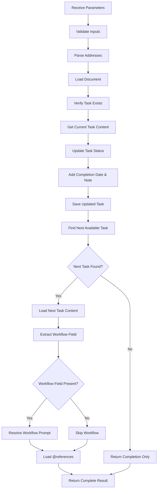

# complete_task Tool Specification

## Overview

The `complete_task` tool marks a task as completed and provides intelligent next task suggestions to maintain workflow continuity. It updates the task status, adds completion notes, and automatically identifies the next available task in the document with task-specific workflow injection (if present).

**Purpose:**
- Mark tasks as completed with completion notes and timestamps
- Automatically suggest the next pending/in-progress task
- Inject task-specific workflow guidance for the next task
- Maintain seamless task progression through document-based workflows

**Key Characteristics:**
- **Sequential Discovery**: Returns next task in document order after the completed task
- **Workflow Injection**: Includes task-specific workflow prompts for next task (if present in task metadata)
- **NO Main Workflow**: Unlike `start_task`, this tool does NOT inject main workflow (only task-specific workflow)
- **Status Update**: Changes task status to "completed" and adds completion date and notes
- **Reference Loading**: Loads hierarchical @references from next task content for context

## Input Parameters

### Required Parameters

| Parameter | Type | Description | Format |
|-----------|------|-------------|--------|
| `document` | string | Document path containing the task | `/path/to/doc.md` (absolute path) |
| `task` | string | Task slug to mark as completed | `#task-slug` or `task-slug` |
| `note` | string | Completion notes or implementation details | Free-form text (max 1000 chars) |

### Parameter Validation

- **document**: Must be valid document path, cannot be empty
- **task**: Must be valid task slug, cannot be empty
- **note**: Must be non-empty string, used for completion audit trail

### Example Input

```json
{
  "document": "/project/implementation.md",
  "task": "setup-database",
  "note": "Configured PostgreSQL with connection pooling and migration system"
}
```

## Output Format

### Response Structure

```typescript
interface CompleteTaskResult {
  completed_task: {
    slug: string;              // Task that was completed
    title: string;             // Task title from heading
    note: string;              // Completion note provided
    completed_date: string;    // YYYY-MM-DD format
  };
  next_task?: {                // Optional: next available task
    slug: string;
    title: string;
    link?: string;             // External link if present
    workflow?: {               // Task-specific workflow (if present)
      name: string;
      description: string;
      content: string;         // Full workflow prompt markdown
      whenToUse: string[];
    };
    referenced_documents?: HierarchicalContent[];  // @references from task
  };
  document_info: {
    slug: string;
    title: string;
    namespace: string;
  };
  timestamp: string;           // ISO 8601 timestamp
}
```

### Response Examples

#### Successful Completion with Next Task

```json
{
  "completed_task": {
    "slug": "initialize-database",
    "title": "Initialize Database",
    "note": "Configured PostgreSQL with connection pooling",
    "completed_date": "2025-10-11"
  },
  "next_task": {
    "slug": "create-api-endpoints",
    "title": "Create API Endpoints",
    "workflow": {
      "name": "spec-first-integration",
      "description": "Spec-First Integration Protocol",
      "content": "# Spec-First Integration\n\n1. Identify authorities...",
      "whenToUse": [
        "New SDKs, webhooks, auth flows",
        "Feature flags touching persistence"
      ]
    },
    "referenced_documents": [
      {
        "path": "/api/specs/rest-api.md",
        "title": "REST API Specification",
        "content": "## API Design\n\n...",
        "depth": 0,
        "namespace": "api/specs",
        "children": []
      }
    ]
  },
  "document_info": {
    "slug": "implementation",
    "title": "Implementation Guide",
    "namespace": "project"
  },
  "timestamp": "2025-10-11T14:30:22.123Z"
}
```

#### Completion of Last Task (No Next Task)

```json
{
  "completed_task": {
    "slug": "final-testing",
    "title": "Final Testing",
    "note": "All tests passing, ready for deployment",
    "completed_date": "2025-10-11"
  },
  "document_info": {
    "slug": "implementation",
    "title": "Implementation Guide",
    "namespace": "project"
  },
  "timestamp": "2025-10-11T15:45:10.456Z"
}
```

## Workflow Details

### Task Completion Process



### Task Status Update

The tool modifies the task content to add completion information:

**Before Completion:**
```markdown
### Setup Database

- Status: in_progress

Configure PostgreSQL database...
```

**After Completion:**
```markdown
### Setup Database

- Status: completed
- Completed: 2025-10-11
- Note: Configured PostgreSQL with connection pooling and migration system

Configure PostgreSQL database...
```

### Next Task Selection Logic

The tool uses `findNextAvailableTask()` to determine the next task:

1. **Find Tasks Section**: Locates the `## Tasks` section in the document
2. **Get All Tasks**: Extracts all task headings under the Tasks section
3. **Enrich with Metadata**: Loads content and metadata for all tasks
4. **Sequential Search**: Starting from the position AFTER the completed task:
   - Find first task with status `pending` or `in_progress`
   - Maintain document order (tasks appear in source order)
5. **Return First Match**: Returns the first available task found

**Example Task Sequence:**
```markdown
## Tasks

### Task A (completed) ← Just completed
### Task B (pending)   ← SELECTED as next_task
### Task C (pending)
### Task D (completed)
```

## Integration Points

### Addressing System Integration

```typescript
// Standard ToolIntegration pattern
const { addresses } = ToolIntegration.validateAndParse({
  document: documentPath,
  task: taskSlug
});

// Guaranteed validation and parsing
addresses.document.path      // Validated document path
addresses.task.slug          // Validated task slug
addresses.task.fullPath      // Full path: /doc.md#task-slug
```

### Task View Utilities

```typescript
import {
  extractTaskTitle,
  findNextAvailableTask,
  enrichTaskWithReferences
} from '../shared/task-view-utilities.js';

// Extract task metadata
const taskTitle = extractTaskTitle(currentContent);

// Find next available task
const nextTaskData = await findNextAvailableTask(
  manager,
  document,
  completedTaskSlug  // Exclude this task from results
);

// Enrich with references
const enrichedTask = await enrichTaskWithReferences(
  manager,
  documentPath,
  taskSlug,
  taskContent
);
```

### Workflow Enrichment

```typescript
import { enrichTaskWithWorkflow } from '../shared/workflow-prompt-utilities.js';

// Enrich next task with task-specific workflow ONLY
const enrichedNext = enrichTaskWithWorkflow(
  {
    slug: nextTaskData.slug,
    title: nextTaskData.title,
    content: nextTaskContent,
    status: nextTaskData.status
  },
  nextTaskContent  // Extract workflow from task content
);

// Result includes workflow field if present
enrichedNext.workflow?.name          // "spec-first-integration"
enrichedNext.workflow?.description   // "Spec-First Integration Protocol"
enrichedNext.workflow?.content       // Full markdown content
enrichedNext.workflow?.whenToUse     // ["New SDKs, webhooks", ...]
```

### Reference Loading

```typescript
import { ReferenceExtractor } from '../shared/reference-extractor.js';
import { ReferenceLoader } from '../shared/reference-loader.js';

// Extract @references from next task content
const extractor = new ReferenceExtractor();
const refs = extractor.extractReferences(nextTaskContent);
const normalized = extractor.normalizeReferences(refs, documentPath);

// Load hierarchical references
const loader = new ReferenceLoader();
const hierarchy = await loader.loadReferences(
  normalized,
  manager,
  config.referenceExtractionDepth  // Default: 3 levels
);

// Include in next_task response
next_task.referenced_documents = hierarchy;
```

## Cache & State Management

### Document Cache Usage

```typescript
// Document loaded with standard access context
const document = await manager.getDocument(addresses.document.path);

// Section content loaded for task
const taskContent = await manager.getSectionContent(
  addresses.document.path,
  addresses.task.slug
);

// Next task content loaded for enrichment
const nextTaskContent = await manager.getSectionContent(
  addresses.document.path,
  nextTaskSlug
);
```

### Reference Loading with Cache

```typescript
// References loaded with REFERENCE context for 2x eviction resistance
const document = await manager.cache.getDocument(
  ref.documentPath,
  AccessContext.REFERENCE  // Higher priority in LRU cache
);
```

### Task Status Update

```typescript
// Update performed via performSectionEdit
await performSectionEdit(
  manager,
  addresses.document.path,
  addresses.task.slug,
  updatedContent,
  'replace'  // Replace entire section content
);

// Cache automatically invalidated and reloaded
// File watcher triggers cache refresh
```

## Use Cases & Examples

### Use Case 1: Complete Task with Workflow Guidance

**Scenario:** Developer completes database setup, needs workflow guidance for next task (API creation)

**Input:**
```json
{
  "document": "/project/backend.md",
  "task": "setup-database",
  "note": "PostgreSQL configured with connection pooling, migrations ready"
}
```

**Task Content:**
```markdown
### Setup Database

- Status: in_progress

Configure PostgreSQL database with connection pooling.

@/database/schema.md
@/database/migrations.md
```

**Next Task Content:**
```markdown
### Create API Endpoints

- Status: pending
- Workflow: spec-first-integration

Implement REST API endpoints following OpenAPI specification.

@/api/specs/rest-api.md
@/api/auth/jwt.md
```

**Output:**
```json
{
  "completed_task": {
    "slug": "setup-database",
    "title": "Setup Database",
    "note": "PostgreSQL configured with connection pooling, migrations ready",
    "completed_date": "2025-10-11"
  },
  "next_task": {
    "slug": "create-api-endpoints",
    "title": "Create API Endpoints",
    "workflow": {
      "name": "spec-first-integration",
      "description": "Spec-First Integration Protocol",
      "content": "# Spec-First Integration\n\n1. Identify authorities...",
      "whenToUse": ["New SDKs, webhooks", "Feature flags"]
    },
    "referenced_documents": [
      {
        "path": "/api/specs/rest-api.md",
        "title": "REST API Specification",
        "content": "...",
        "depth": 0,
        "namespace": "api/specs",
        "children": [
          {
            "path": "/api/auth/jwt.md",
            "title": "JWT Authentication",
            "content": "...",
            "depth": 1,
            "namespace": "api/auth",
            "children": []
          }
        ]
      }
    ]
  },
  "document_info": {
    "slug": "backend",
    "title": "Backend Implementation",
    "namespace": "project"
  },
  "timestamp": "2025-10-11T10:30:00.000Z"
}
```

### Use Case 2: Complete Last Task

**Scenario:** Developer completes final task in document, no next task available

**Input:**
```json
{
  "document": "/project/setup.md",
  "task": "deploy-to-production",
  "note": "Successfully deployed to production, all health checks passing"
}
```

**Output:**
```json
{
  "completed_task": {
    "slug": "deploy-to-production",
    "title": "Deploy to Production",
    "note": "Successfully deployed to production, all health checks passing",
    "completed_date": "2025-10-11"
  },
  "document_info": {
    "slug": "setup",
    "title": "Project Setup",
    "namespace": "project"
  },
  "timestamp": "2025-10-11T16:00:00.000Z"
}
```

### Use Case 3: Skip Completed Tasks to Find Next Pending

**Scenario:** Multiple tasks completed, tool finds first pending task

**Document Structure:**
```markdown
## Tasks

### Task A
- Status: completed

### Task B
- Status: completed

### Task C  ← Just completed
- Status: pending

### Task D
- Status: completed

### Task E  ← SELECTED as next_task
- Status: pending

### Task F
- Status: pending
```

**Input:**
```json
{
  "document": "/project/tasks.md",
  "task": "task-c",
  "note": "Implementation complete"
}
```

**Output:**
```json
{
  "completed_task": {
    "slug": "task-c",
    "title": "Task C",
    "note": "Implementation complete",
    "completed_date": "2025-10-11"
  },
  "next_task": {
    "slug": "task-e",
    "title": "Task E",
    "...": "..."
  },
  "...": "..."
}
```

### Use Case 4: Task Without Workflow (Standard Progression)

**Scenario:** Complete task, next task has no workflow field

**Next Task Content:**
```markdown
### Implement Logging

- Status: pending

Add structured logging throughout the application.

@/logging/standards.md
```

**Output:**
```json
{
  "completed_task": {
    "slug": "setup-auth",
    "title": "Setup Authentication",
    "note": "JWT authentication implemented",
    "completed_date": "2025-10-11"
  },
  "next_task": {
    "slug": "implement-logging",
    "title": "Implement Logging",
    "referenced_documents": [
      {
        "path": "/logging/standards.md",
        "title": "Logging Standards",
        "content": "...",
        "depth": 0,
        "namespace": "logging",
        "children": []
      }
    ]
  },
  "document_info": {
    "slug": "backend",
    "title": "Backend Implementation",
    "namespace": "project"
  },
  "timestamp": "2025-10-11T11:00:00.000Z"
}
```

**Note:** No `workflow` field present since next task doesn't specify workflow.

## Implementation Details

### Next Task Selection Algorithm

```typescript
async function findNextAvailableTask(
  manager: DocumentManager,
  document: CachedDocument,
  excludeTaskSlug?: string
): Promise<TaskViewData | null> {

  // 1. Find Tasks section
  const tasksSection = document.headings.find(h =>
    h.slug === 'tasks' || h.title.toLowerCase() === 'tasks'
  );
  if (tasksSection == null) return null;

  // 2. Get all task headings in document order
  const taskHeadings = await getTaskHeadingsFromHeadings(document, tasksSection);

  // 3. Enrich all tasks with metadata
  const allTasks = await enrichMultipleTasks(
    manager,
    document.metadata.path,
    taskHeadings.map(heading => ({ slug: heading.slug, heading }))
  );

  // 4. Find position of excluded task
  let startIndex = 0;
  if (excludeTaskSlug != null && excludeTaskSlug !== '') {
    const excludedIndex = allTasks.findIndex(task => task.slug === excludeTaskSlug);
    if (excludedIndex !== -1) {
      startIndex = excludedIndex + 1; // Start search after excluded task
    }
  }

  // 5. Find first available task after excluded task
  for (let i = startIndex; i < allTasks.length; i++) {
    const task = allTasks[i];
    if (task != null && (task.status === 'pending' || task.status === 'in_progress')) {
      return task;
    }
  }

  return null;
}
```

### Completion Notes Handling

Completion notes are appended to the task content:

```typescript
function updateTaskStatus(
  content: string,
  newStatus: string,
  note: string,
  completedDate: string
): string {
  // Update status line
  let updated = content.replace(/^- Status:\s*.+$/m, `- Status: ${newStatus}`);

  // Add completion info
  updated += `\n- Completed: ${completedDate}`;
  updated += `\n- Note: ${note}`;

  return updated;
}
```

**Result:**
```markdown
### Task Name

- Status: completed
- Completed: 2025-10-11
- Note: Implementation complete with all tests passing

Original task content...
```

### Workflow Field Extraction

Task-specific workflow extracted from next task content:

```typescript
// Extract workflow name from task metadata
function extractWorkflowName(content: string): string | null {
  const fieldRegex = /^[\s*-]+Workflow:[ \t]*(.*)$/m;
  const match = content.match(fieldRegex);

  if (match != null) {
    return match[1]?.trim() ?? '';
  }

  return null;
}

// Resolve workflow prompt by name
function resolveWorkflowPrompt(workflowName: string): WorkflowPrompt | null {
  if (workflowName == null || workflowName === '') {
    return null;
  }

  try {
    const prompt = getWorkflowPrompt(workflowName);
    return prompt ?? null;
  } catch {
    return null;
  }
}

// Enrich task with workflow
const enrichedTask = enrichTaskWithWorkflow(taskData, taskContent);
```

### Error Handling

```typescript
try {
  // Validate parameters
  const documentPath = ToolIntegration.validateStringParameter(args['document'], 'document');
  const taskSlug = ToolIntegration.validateStringParameter(args['task'], 'task');
  const note = ToolIntegration.validateStringParameter(args['note'], 'note');

  // Parse addresses
  const { addresses } = ToolIntegration.validateAndParse({
    document: documentPath,
    task: taskSlug
  });

  // Verify document exists
  const document = await manager.getDocument(addresses.document.path);
  if (document == null) {
    throw new DocumentNotFoundError(addresses.document.path);
  }

  // Verify task exists
  const currentContent = await manager.getSectionContent(
    addresses.document.path,
    addresses.task.slug
  );
  if (currentContent == null || currentContent === '') {
    throw new AddressingError(`Task not found: ${addresses.task.slug}`, 'TASK_NOT_FOUND', {
      document: addresses.document.path,
      task: addresses.task.slug
    });
  }

  // ... continue with task completion

} catch (error) {
  if (error instanceof AddressingError) {
    throw error;  // Re-throw with context
  }
  throw new AddressingError(
    `Task completion failed: ${error instanceof Error ? error.message : String(error)}`,
    'COMPLETION_FAILED'
  );
}
```

## Comparison with Related Tools

### complete_task vs start_task vs view_task

| Feature | complete_task | start_task | view_task |
|---------|---------------|------------|-----------|
| **Purpose** | Complete task, get next | Start/resume work | Inspect task data |
| **Task Workflow** | ✅ Next task only | ✅ Current task | ✅ Current task |
| **Main Workflow** | ❌ Never | ✅ Yes (from first task) | ❌ Never |
| **References** | ✅ Next task only | ✅ Current task | ✅ Current task |
| **Status Update** | ✅ Marks completed | ❌ Read-only | ❌ Read-only |
| **Next Task** | ✅ Automatic | ❌ No | ❌ No |
| **Use Case** | Task progression | Session start | Inspection |

### Workflow Injection Differences

**complete_task:**
```json
{
  "next_task": {
    "workflow": { /* Task-specific workflow ONLY */ }
    // NO main_workflow field
  }
}
```

**start_task:**
```json
{
  "task": {
    "workflow": { /* Task-specific workflow */ },
    "main_workflow": { /* Main workflow from first task */ }
  }
}
```

**view_task:**
```json
{
  "task": {
    "workflow_name": "spec-first-integration"  // String only, not full object
  }
}
```

## Best Practices

### 1. Provide Meaningful Completion Notes

```json
// ✅ Good - Specific completion details
{
  "note": "Implemented JWT authentication with refresh tokens, added rate limiting"
}

// ❌ Bad - Generic note
{
  "note": "Done"
}
```

### 2. Use Sequential Task Flow

Complete tasks in document order to maintain workflow continuity:

```markdown
## Tasks

### Task 1: Setup
- Status: completed

### Task 2: Implementation  ← Complete in order
- Status: in_progress

### Task 3: Testing  ← Will be next_task
- Status: pending
```

### 3. Leverage Workflow Guidance

When next task has workflow field, review the workflow content before starting:

```json
{
  "next_task": {
    "workflow": {
      "content": "# Spec-First Integration\n\n1. Identify authorities...",
      "whenToUse": ["New SDKs, webhooks", "Feature flags"]
    }
  }
}
```

### 4. Review Referenced Documents

Check `referenced_documents` for context before starting next task:

```json
{
  "next_task": {
    "referenced_documents": [
      {
        "path": "/api/specs/rest-api.md",
        "title": "REST API Specification",
        // ... full content loaded
      }
    ]
  }
}
```

### 5. Handle Last Task Appropriately

When `next_task` is undefined, all tasks are complete:

```typescript
if (result.next_task == null) {
  console.log('All tasks completed!');
  // Perform final actions (testing, deployment, etc.)
}
```

## Error Scenarios

### Missing Document

```json
// Input
{
  "document": "/nonexistent/doc.md",
  "task": "some-task",
  "note": "Done"
}

// Error
{
  "error": "DocumentNotFoundError",
  "message": "Document not found: /nonexistent/doc.md",
  "code": "DOCUMENT_NOT_FOUND"
}
```

### Missing Task

```json
// Input
{
  "document": "/project/tasks.md",
  "task": "missing-task",
  "note": "Done"
}

// Error
{
  "error": "AddressingError",
  "message": "Task not found: missing-task",
  "code": "TASK_NOT_FOUND",
  "context": {
    "document": "/project/tasks.md",
    "task": "missing-task"
  }
}
```

### Invalid Parameters

```json
// Missing required parameter
{
  "document": "/project/tasks.md",
  "task": "some-task"
  // Missing "note" parameter
}

// Error
{
  "error": "AddressingError",
  "message": "note parameter is required",
  "code": "MISSING_PARAMETER"
}
```

## Configuration

### Reference Loading Depth

Control how deep @references are loaded:

```bash
# .env
REFERENCE_EXTRACTION_DEPTH=3  # Default: 3, Range: 1-5
```

**Impact on next_task:**
- `1`: Only direct references loaded
- `3`: Three levels of nested references (recommended)
- `5`: Maximum depth, may increase response time

### Cache Configuration

Reference loading uses `AccessContext.REFERENCE` for 2x eviction resistance in LRU cache.

## Performance Considerations

### Batch Task Enrichment

Finding next task enriches all tasks once, then filters:

```typescript
// Efficient: Single batch enrichment
const allTasks = await enrichMultipleTasks(manager, documentPath, taskHeadings);

// Then filter for next available
const nextTask = allTasks.find(t =>
  t.status === 'pending' || t.status === 'in_progress'
);
```

### Reference Loading Limits

- **Max total nodes**: 1000 across all branches
- **Timeout**: 30 seconds for entire operation
- **Cycle detection**: Prevents infinite loops

### Cache Optimization

- Document cache: LRU with 1000 item limit
- Reference context: 2x eviction resistance
- Automatic invalidation on file changes

## Testing Recommendations

### Unit Testing

Test key behaviors:
- Parameter validation
- Task completion status update
- Next task selection logic
- Workflow injection (task-specific only)
- Reference loading
- Edge cases (no next task, invalid workflow)

### Integration Testing

Test with MCP Inspector:
```bash
pnpm build
npx @modelcontextprotocol/inspector node dist/index.js
```

**Test scenarios:**
1. Complete task with next task having workflow
2. Complete task with next task having no workflow
3. Complete last task (no next task)
4. Complete task with multiple @references
5. Invalid task slug
6. Invalid document path

### Example Test Case

```typescript
it('should inject full workflow object for next task', async () => {
  const result = await completeTask({
    document: '/test.md',
    task: 'first-task',
    note: 'Completed successfully'
  }, sessionState, manager);

  expect(result.completed_task.slug).toBe('first-task');
  expect(result.next_task?.slug).toBe('second-task');
  expect(result.next_task?.workflow).toBeDefined();
  expect(result.next_task?.workflow?.content).toContain('# Workflow');
});
```

## Summary

The `complete_task` tool provides intelligent task completion with automatic next task discovery and workflow injection. It maintains seamless task progression by:

1. **Marking tasks complete** with timestamps and notes
2. **Finding the next available task** in document order
3. **Injecting task-specific workflow** for guidance
4. **Loading hierarchical references** for context
5. **Maintaining audit trail** with completion details

This tool is optimized for **workflow continuation** (not session start like `start_task`), providing just enough context to keep work flowing while conserving tokens by excluding main workflow injection.
