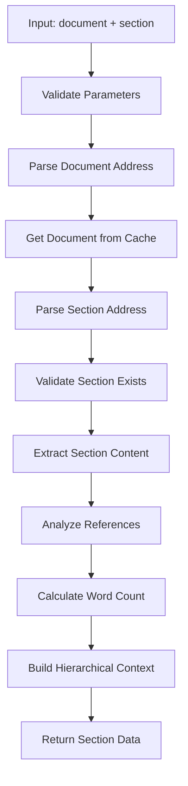
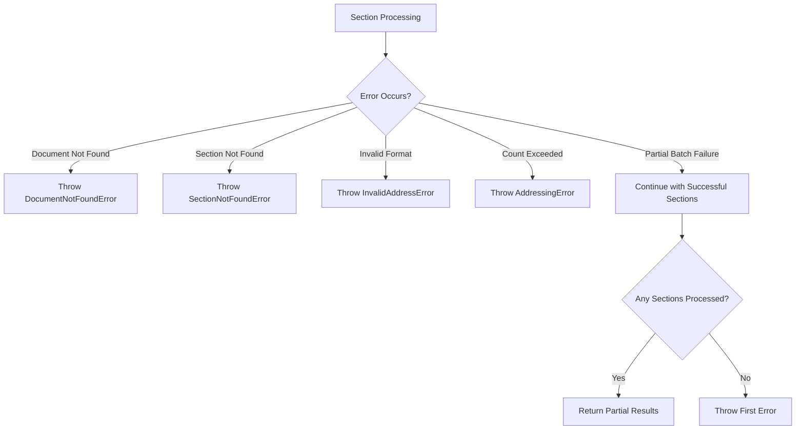

# view_section Tool Specification

## Overview

**Purpose**: Provides clean, focused section content viewing without the overhead of document statistics. Designed for efficient content inspection and reference loading workflows.

**Key Features**:
- Clean section content extraction without document-level statistics
- Multiple section batch viewing in single operation
- Hierarchical section addressing support with automatic depth detection
- Reference extraction and link analysis per section
- Graceful partial failure handling for batch operations
- Word count and parent section tracking per section

**Position in Tool Suite**:
- Focused on **content viewing only** (no editing capabilities)
- Complementary to `section` tool (which handles create/edit/delete operations)
- Lighter weight than `view_document` (which includes comprehensive document statistics)
- Ideal for reference loading and content inspection workflows

---

## Input Parameters

### Schema Definition

```typescript
{
  type: 'object',
  properties: {
    document: {
      type: 'string',
      description: 'Document path (e.g., "/specs/auth-api.md")'
    },
    section: {
      type: 'string' | 'array',
      description: 'Section slug(s) to view (e.g., "#endpoints" or ["#endpoints", "#authentication"])'
    }
  },
  required: ['document', 'section'],
  additionalProperties: false
}
```

### Parameter Details

#### `document` (required)
- **Type**: `string`
- **Format**: Absolute path starting with `/` and ending with `.md`
- **Example**: `"/specs/auth-api.md"`, `"/project/setup.md"`
- **Validation**: Must be non-empty string, validated via `ToolIntegration.validateDocumentParameter()`

#### `section` (required)
- **Type**: `string | string[]`
- **Format**: Section slug(s) with optional `#` prefix
- **Single Section**: `"overview"` or `"#overview"`
- **Multiple Sections**: `["#overview", "#endpoints", "#authentication"]`
- **Hierarchical Sections**: Supports forward slash notation (e.g., `"authentication/jwt-tokens"`)
- **Limit**: Maximum 10 sections per request (enforced via `VIEW_SECTION_CONSTANTS.MAX_SECTIONS`)
- **Validation**: Normalized via `ToolIntegration.validateArrayParameter()` and count limit enforced

---

## Output Format

### Response Structure

```typescript
interface ViewSectionResponse {
  document: string;                          // Document path
  sections: Array<{
    slug: string;                            // Section slug (normalized, no #)
    title: string;                           // Section heading title
    content: string;                         // Section content (markdown)
    depth: number;                           // Heading depth (1-6)
    full_path: string;                       // Full path: /doc.md#section
    parent?: string;                         // Parent section slug (if child)
    word_count: number;                      // Word count for content
    links: string[];                         // Extracted @references
    hierarchical_context: HierarchicalContext | null;
  }>;
  summary: {
    total_sections: number;                  // Count of sections viewed
    total_words: number;                     // Sum of all word counts
    has_content: boolean;                    // True if any section has content
    hierarchical_stats: {
      max_depth: number;                     // Max hierarchical depth
      namespaces: string[];                  // Unique parent paths
      flat_sections: number;                 // Count of flat sections
      hierarchical_sections: number;         // Count of hierarchical sections
    };
  };
}

interface HierarchicalContext {
  full_path: string;                         // Full hierarchical path
  parent_path: string;                       // Parent path component
  section_name: string;                      // Final section name
  depth: number;                             // Hierarchical depth
}
```

### Field Descriptions

#### Section Fields

- **`slug`**: Normalized section slug without `#` prefix (e.g., `"overview"`, `"authentication/jwt-tokens"`)
- **`title`**: Original heading title from document
- **`content`**: Raw markdown content of the section (excluding heading line)
- **`depth`**: Markdown heading level (1-6) where 1 is `#` and 6 is `######`
- **`full_path`**: Complete section address in format `/document.md#section`
  - Flat sections: `/api/auth.md#overview`
  - Hierarchical: `/api/auth.md#authentication/jwt-tokens (hierarchical)`
- **`parent`**: Parent section slug if this is a child section (optional)
  - Example: For `authentication/jwt-tokens`, parent is `authentication`
- **`word_count`**: Count of space-separated words in section content
- **`links`**: Array of extracted `@references` from section content
  - Extracted via `ReferenceExtractor`
  - Includes cross-document (`@/path/doc.md`) and within-document (`@#section`) references
- **`hierarchical_context`**: Detailed hierarchical information (null for flat sections)
  - Only present for sections with forward slashes in slug
  - Provides parent path, section name, and depth information

#### Summary Fields

- **`total_sections`**: Count of successfully processed sections
- **`total_words`**: Sum of word counts across all sections
- **`has_content`**: Boolean indicating if any section contains non-empty content
- **`hierarchical_stats`**: Aggregate hierarchical information
  - `max_depth`: Maximum hierarchical depth across all sections
  - `namespaces`: Unique parent paths found in hierarchical sections
  - `flat_sections`: Count of traditional flat sections
  - `hierarchical_sections`: Count of hierarchical sections (containing `/`)

---

## Workflow

### Single Section Viewing



### Multiple Section Viewing

```mermaid
graph TD
    A[Input: document + sections[]] --> B[Validate Count Limit]
    B --> C[Parse Document Address]
    C --> D[Get Document from Cache]
    D --> E[Parse All Section Addresses]
    E --> F{All Addresses Valid?}
    F -->|No| G[Throw First Error]
    F -->|Yes| H[Validate Sections Exist]
    H --> I[Process Sections in Parallel]
    I --> J{All Processed?}
    J -->|Partial Failure| K[Return Successful Sections]
    J -->|All Success| L[Return All Sections]
    K --> M[Calculate Summary Stats]
    L --> M
    M --> N[Return Response]
```

### Error Handling Flow



---

## Integration Points

### Document Manager

**Purpose**: Document retrieval and section content extraction

**Key Operations**:
```typescript
const manager = new DocumentManager(docsRoot);

// Get cached document with metadata and headings
const document = await manager.getDocument(documentPath);

// Extract section content using normalized slug
const content = await manager.getSectionContent(documentPath, sectionSlug);
```

**Integration Pattern**:
1. Document retrieved via `getDocument()` for validation and metadata
2. Section content extracted via `getSectionContent()` for each section
3. Document cache automatically handles file system operations

### Central Addressing System

**Purpose**: Type-safe address parsing and validation

**Key Components**:

```typescript
import { ToolIntegration, parseSectionAddress } from '../shared/addressing-system.js';

// Validate and parse document address
const { addresses } = ToolIntegration.validateAndParse({
  document: documentPath
});

// Parse individual section addresses
const sectionAddr = parseSectionAddress(sectionSlug, documentPath);

// Format section path for response
const fullPath = ToolIntegration.formatSectionPath(sectionAddr);

// Build hierarchical context
const hierarchicalContext = ToolIntegration.formatHierarchicalContext(sectionAddr);
```

**Integration Benefits**:
- Consistent address validation across all tools
- Automatic caching of parsed addresses
- Type-safe address objects with metadata
- Standardized error handling with context

### Reference Extractor

**Purpose**: Unified @reference extraction from section content

**Usage Pattern**:
```typescript
import { ReferenceExtractor } from '../../shared/reference-extractor.js';

const extractor = new ReferenceExtractor();

// Extract all @references from section content
const references = extractor.extractReferences(content);

// Returns array of reference strings: ['@/api/auth.md', '@#overview', ...]
```

**Reference Formats Detected**:
- Within-document: `@#section-slug`
- Cross-document: `@/path/document.md`
- Cross-document with section: `@/path/document.md#section`

### Shared Utilities

**Purpose**: Hierarchical section analysis

**Key Function**:
```typescript
import { getParentSlug } from '../../shared/utilities.js';

// Extract parent slug from hierarchical section
const parent = getParentSlug('authentication/jwt-tokens');
// Returns: 'authentication'

const noParent = getParentSlug('overview');
// Returns: undefined
```

---

## Cache & State Management

### Document Cache Integration

**Cache Access Pattern**:
```typescript
// Document cache automatically consulted via DocumentManager
const document = await manager.getDocument(documentPath);

// Cache considerations:
// - Documents cached with LRU eviction (1000 document limit)
// - Headings parsed and cached with document
// - Section content dynamically extracted (not cached separately)
```

**Cache Lifecycle**:
1. **Document Loading**: First access loads from filesystem and caches
2. **Subsequent Access**: Retrieved from cache (fast path)
3. **Invalidation**: Automatic via file watcher when document changes
4. **Eviction**: LRU policy when cache exceeds 1000 documents

### Address Cache Batch Pattern

**Batch Cache Usage**:
```typescript
// Address cache automatically used for batch operations
// Addresses cached within batch scope for duplicate lookups

// Example: Multiple section viewing
for (const section of sections) {
  const addr = parseSectionAddress(section, docPath);  // First lookup caches
  // Subsequent lookups for same section hit cache
}

// Batch cache cleared automatically after batch timeout (60s)
```

**Cache Benefits**:
- Reduces redundant parsing during batch operations
- Scoped lifetime (cleared after batch or timeout)
- Simple Map-based implementation (not LRU)

### Session State

**No Session State Required**: `view_section` is a stateless tool

```typescript
export async function viewSection(
  args: Record<string, unknown>,
  _state: SessionState,        // Not used
  manager: DocumentManager
): Promise<ViewSectionResponse>
```

**Rationale**:
- Simple query operation with no workflow state
- No progressive discovery stages
- No persistent session tracking needed

---

## Use Cases & Examples

### Use Case 1: Single Section Content Inspection

**Scenario**: View content of a specific section for reference

**Input**:
```json
{
  "document": "/api/auth.md",
  "section": "jwt-tokens"
}
```

**Output**:
```json
{
  "document": "/api/auth.md",
  "sections": [
    {
      "slug": "jwt-tokens",
      "title": "JWT Tokens",
      "content": "## JWT Tokens\n\nOur authentication system uses JWT tokens...\n\nSee @/api/security.md for security guidelines.",
      "depth": 2,
      "full_path": "/api/auth.md#jwt-tokens",
      "parent": "authentication",
      "word_count": 45,
      "links": ["@/api/security.md"],
      "hierarchical_context": null
    }
  ],
  "summary": {
    "total_sections": 1,
    "total_words": 45,
    "has_content": true,
    "hierarchical_stats": {
      "max_depth": 0,
      "namespaces": [],
      "flat_sections": 1,
      "hierarchical_sections": 0
    }
  }
}
```

### Use Case 2: Multiple Section Batch Viewing

**Scenario**: Compare multiple related sections in a single request

**Input**:
```json
{
  "document": "/api/auth.md",
  "section": ["#overview", "#authentication", "#authorization"]
}
```

**Output**:
```json
{
  "document": "/api/auth.md",
  "sections": [
    {
      "slug": "overview",
      "title": "Overview",
      "content": "This document describes the authentication API...",
      "depth": 2,
      "full_path": "/api/auth.md#overview",
      "word_count": 28,
      "links": [],
      "hierarchical_context": null
    },
    {
      "slug": "authentication",
      "title": "Authentication",
      "content": "Authentication is handled via JWT tokens. See @#jwt-tokens for details.",
      "depth": 2,
      "full_path": "/api/auth.md#authentication",
      "word_count": 12,
      "links": ["@#jwt-tokens"],
      "hierarchical_context": null
    },
    {
      "slug": "authorization",
      "title": "Authorization",
      "content": "Authorization uses role-based access control...",
      "depth": 2,
      "full_path": "/api/auth.md#authorization",
      "word_count": 35,
      "links": [],
      "hierarchical_context": null
    }
  ],
  "summary": {
    "total_sections": 3,
    "total_words": 75,
    "has_content": true,
    "hierarchical_stats": {
      "max_depth": 0,
      "namespaces": [],
      "flat_sections": 3,
      "hierarchical_sections": 0
    }
  }
}
```

### Use Case 3: Hierarchical Section Viewing

**Scenario**: View deeply nested hierarchical section

**Input**:
```json
{
  "document": "/project/architecture.md",
  "section": "backend/services/authentication/jwt-handler"
}
```

**Output**:
```json
{
  "document": "/project/architecture.md",
  "sections": [
    {
      "slug": "backend/services/authentication/jwt-handler",
      "title": "JWT Handler",
      "content": "## JWT Handler\n\nImplements JWT token validation and generation...",
      "depth": 5,
      "full_path": "/project/architecture.md#backend/services/authentication/jwt-handler (hierarchical)",
      "parent": "backend/services/authentication",
      "word_count": 120,
      "links": ["@/api/auth.md#jwt-tokens"],
      "hierarchical_context": {
        "full_path": "backend/services/authentication/jwt-handler",
        "parent_path": "backend/services/authentication",
        "section_name": "jwt-handler",
        "depth": 4
      }
    }
  ],
  "summary": {
    "total_sections": 1,
    "total_words": 120,
    "has_content": true,
    "hierarchical_stats": {
      "max_depth": 4,
      "namespaces": ["backend/services/authentication"],
      "flat_sections": 0,
      "hierarchical_sections": 1
    }
  }
}
```

### Use Case 4: Reference Loading Workflow

**Scenario**: Load section content to extract and follow references

**Workflow**:
```typescript
// 1. View section to extract references
const response = await viewSection({
  document: '/api/auth.md',
  section: 'jwt-tokens'
});

// 2. Extract references from section
const section = response.sections[0];
const references = section.links;  // ['@/api/security.md', '@#overview']

// 3. Load referenced content
for (const ref of references) {
  // Parse reference and load content
  // Build hierarchical reference tree
}
```

### Use Case 5: Empty Section Handling

**Scenario**: View section with no content

**Input**:
```json
{
  "document": "/project/roadmap.md",
  "section": "future-work"
}
```

**Output**:
```json
{
  "document": "/project/roadmap.md",
  "sections": [
    {
      "slug": "future-work",
      "title": "Future Work",
      "content": "",
      "depth": 2,
      "full_path": "/project/roadmap.md#future-work",
      "word_count": 0,
      "links": [],
      "hierarchical_context": null
    }
  ],
  "summary": {
    "total_sections": 1,
    "total_words": 0,
    "has_content": false,
    "hierarchical_stats": {
      "max_depth": 0,
      "namespaces": [],
      "flat_sections": 1,
      "hierarchical_sections": 0
    }
  }
}
```

### Use Case 6: Error Handling - Section Not Found

**Scenario**: Attempt to view non-existent section

**Input**:
```json
{
  "document": "/api/auth.md",
  "section": "missing-section"
}
```

**Error Response**:
```json
{
  "error": "Section not found: missing-section in /api/auth.md",
  "code": "SECTION_NOT_FOUND",
  "context": {
    "slug": "missing-section",
    "documentPath": "/api/auth.md"
  }
}
```

### Use Case 7: Graceful Partial Failure

**Scenario**: Batch request with some invalid sections

**Input**:
```json
{
  "document": "/api/auth.md",
  "section": ["#overview", "#missing", "#authentication"]
}
```

**Behavior**:
- Validates all section addresses first
- If validation fails for any, throws error immediately
- Does not return partial results for validation errors
- This ensures consistent behavior and clear error messages

---

## Implementation Details

### Section Content Extraction Algorithm

**Source**: `DocumentManager.getSectionContent()`

**Algorithm**:
1. Retrieve cached document with parsed headings
2. Locate target section by slug in headings array
3. Find section start position (line after heading)
4. Find section end position (next heading at same/higher level or EOF)
5. Extract content slice between start and end
6. Return content string (or empty string if no content)

**Edge Cases**:
- Empty sections return empty string (not null)
- Sections at end of document extract until EOF
- Child sections not included in parent content
- Preserves exact markdown formatting and whitespace

### Multiple Section Batching Strategy

**Implementation Pattern**:
```typescript
// 1. Parallel address parsing with Promise.allSettled
const sectionAddressResults = await Promise.allSettled(
  sections.map(slug => parseSectionAddress(slug, documentPath))
);

// 2. Separate successful from failed addresses
const successfulAddresses = results
  .filter(r => r.status === 'fulfilled')
  .map(r => r.value);

// 3. Fail fast if all parsing failed
if (successfulAddresses.length === 0) {
  throw firstError;
}

// 4. Parallel section processing with Promise.allSettled
const sectionProcessingResults = await Promise.allSettled(
  successfulAddresses.map(async addr => {
    const content = await manager.getSectionContent(addr.document.path, addr.slug);
    // ... build section data
    return sectionData;
  })
);

// 5. Return all successful sections
const processedSections = results
  .filter(r => r.status === 'fulfilled')
  .map(r => r.value);
```

**Graceful Failure Handling**:
- Uses `Promise.allSettled` for non-blocking parallel processing
- Collects all successful sections regardless of individual failures
- Only throws error if ALL sections fail
- Returns partial results when at least one section succeeds

### Reference Extraction Implementation

**Source**: `ReferenceExtractor`

**Regex Pattern**:
```typescript
private static readonly REFERENCE_PATTERN =
  /@(?:\/[^\s\]),;:!?]+(?:#[^\s\]),;:!?]*)?|#[^\s\]),;:!?]*)/g;
```

**Extraction Algorithm**:
1. Scan content for all matches of `@reference` pattern
2. Clean trailing punctuation from matches
3. Deduplicate references (same reference mentioned multiple times)
4. Return array of unique reference strings

**Reference Format Support**:
- `@#section` - Within-document section reference
- `@/path/doc.md` - Cross-document reference
- `@/path/doc` - Cross-document (auto-adds .md)
- `@/path/doc.md#section` - Cross-document with section target

### Word Count Calculation

**Implementation**:
```typescript
const wordCount = content
  .split(/\s+/)                    // Split on whitespace
  .filter(word => word.length > 0) // Remove empty strings
  .length;                         // Count words
```

**Behavior**:
- Whitespace-based splitting (spaces, tabs, newlines)
- Empty strings filtered out (consecutive whitespace counted as one)
- Simple and fast (no complex tokenization)
- Consistent with markdown conventions

### Hierarchical Context Building

**Implementation**:
```typescript
static formatHierarchicalContext(section: SectionAddress): HierarchicalContext | null {
  if (!section.slug.includes('/')) {
    return null;  // Flat section
  }

  const parts = section.slug.split('/');
  return {
    full_path: section.slug,
    parent_path: parts.slice(0, -1).join('/'),
    section_name: parts[parts.length - 1] ?? '',
    depth: parts.length
  };
}
```

**Output Examples**:
- `"overview"` → `null` (flat section)
- `"auth/jwt"` → `{ full_path: "auth/jwt", parent_path: "auth", section_name: "jwt", depth: 2 }`
- `"a/b/c/d"` → `{ full_path: "a/b/c/d", parent_path: "a/b/c", section_name: "d", depth: 4 }`

### Summary Statistics Aggregation

**Calculation Logic**:
```typescript
// Count hierarchical vs flat sections
const hierarchicalSections = sections.filter(s => s.hierarchical_context != null);
const flatSections = sections.filter(s => s.hierarchical_context == null);

// Extract unique namespaces
const namespaces = [...new Set(
  hierarchicalSections
    .map(s => s.hierarchical_context?.parent_path)
    .filter(path => path != null && path !== '')
)];

// Calculate max depth
const maxDepth = Math.max(
  ...hierarchicalSections.map(s => s.hierarchical_context?.depth ?? 0),
  0
);

// Sum word counts
const totalWords = sections.reduce((sum, s) => sum + s.word_count, 0);

// Check for content
const hasContent = sections.some(s => s.content.trim() !== '');
```

---

## Error Handling

### Error Types

**From Addressing System**:
- `DocumentNotFoundError` - Document path invalid or document not found
- `SectionNotFoundError` - Section slug not found in document
- `InvalidAddressError` - Malformed document or section reference
- `AddressingError` - General parameter validation errors

**Tool-Specific**:
- Count limit exceeded (via `ToolIntegration.validateCountLimit()`)
- Invalid parameter types (via `ToolIntegration.validateArrayParameter()`)

### Error Response Format

**Standard Error Structure**:
```json
{
  "error": "Error message describing the issue",
  "code": "ERROR_CODE",
  "context": {
    "key": "value",
    "additional": "context"
  }
}
```

### Error Examples

**Document Not Found**:
```json
{
  "error": "Document not found: /invalid/path.md",
  "code": "DOCUMENT_NOT_FOUND",
  "context": {
    "path": "/invalid/path.md"
  }
}
```

**Section Not Found**:
```json
{
  "error": "Section not found: missing-section in /api/auth.md",
  "code": "SECTION_NOT_FOUND",
  "context": {
    "slug": "missing-section",
    "documentPath": "/api/auth.md"
  }
}
```

**Count Limit Exceeded**:
```json
{
  "error": "Too many sections. Maximum 10 sections allowed, got 15",
  "code": "TOO_MANY_SECTIONS",
  "context": {
    "maxCount": 10,
    "actualCount": 15
  }
}
```

**Invalid Parameter**:
```json
{
  "error": "section parameter is required and must be a string or array of strings",
  "code": "INVALID_PARAMETER",
  "context": {
    "paramName": "section",
    "actualValue": null
  }
}
```

### Error Recovery Strategies

**For Batch Operations**:
1. **Pre-validation Phase**: Validate all section addresses before processing
2. **Fail Fast**: If all addresses invalid, throw first error immediately
3. **Graceful Continuation**: Process valid addresses even if some fail parsing
4. **Partial Results**: Return successfully processed sections when possible
5. **Complete Failure**: Only throw error if zero sections successfully processed

**For Single Section**:
1. **Immediate Validation**: Fail fast on invalid parameters
2. **Clear Error Messages**: Provide actionable error context
3. **No Partial Results**: Either complete success or complete failure

---

## Comparison with Related Tools

### vs. `view_document`

| Feature | `view_section` | `view_document` |
|---------|---------------|-----------------|
| **Purpose** | Section content inspection | Complete document overview |
| **Output** | Section content only | Full document + statistics |
| **Statistics** | Per-section word counts | Full document stats (headings, sections, tasks, etc.) |
| **Performance** | Lighter weight | Heavier (full document analysis) |
| **Use Case** | Quick content lookup | Comprehensive document inspection |
| **Batch Support** | Yes (10 sections) | Limited (focused on single document) |

### vs. `section` tool

| Feature | `view_section` | `section` |
|---------|---------------|-----------|
| **Purpose** | View content only | Create/edit/delete operations |
| **Read Operations** | View only | View as part of edit workflow |
| **Write Operations** | None | Full CRUD (create, edit, remove) |
| **Use Case** | Content inspection | Content management |
| **Complexity** | Simple query | Complex operation handling |

### vs. `view_task`

| Feature | `view_section` | `view_task` |
|---------|---------------|------------|
| **Purpose** | General section viewing | Task-specific viewing |
| **Task Focus** | No special task handling | Task status, metadata extraction |
| **Output** | Generic section data | Task-specific fields (status, due date, etc.) |
| **Use Case** | Any section content | Task tracking workflow |

---

## Performance Considerations

### Caching Strategy

**Document Cache**:
- Documents cached in memory (LRU, 1000 limit)
- First access: Filesystem read + parse (slower)
- Subsequent access: Cache hit (fast)
- Invalidation: Automatic via file watcher

**Address Cache**:
- Batch-scoped address parsing cache
- Reduces redundant parsing in batch operations
- Auto-clears after 60 seconds or explicit clear
- Simple Map implementation (not LRU)

### Batch Operation Optimization

**Parallel Processing**:
```typescript
// Sections processed in parallel using Promise.allSettled
const results = await Promise.allSettled(
  sections.map(async section => {
    // Each section processed concurrently
    return await processSection(section);
  })
);
```

**Benefits**:
- Multiple sections processed simultaneously
- No sequential bottleneck
- Failed sections don't block successful ones
- Overall batch time = slowest section, not sum

### Memory Footprint

**Single Section**:
- Document metadata + headings: ~5-10KB
- Section content: Variable (typically 1-50KB)
- Address objects: ~1KB
- Total: ~10-60KB per request

**Batch (10 sections)**:
- Single document loaded: ~5-10KB
- 10 section contents: Variable (10-500KB)
- 10 address objects: ~10KB
- Total: ~25-520KB per batch request

**Cache Impact**:
- Document cache: Up to 1000 documents (50MB-500MB depending on size)
- Address cache: Small, batch-scoped (typically <1MB)

### Scaling Limits

**Document Size**:
- Large documents (>1MB) may impact performance
- Cached after first load (subsequent fast)
- Section extraction still fast (slice operation)

**Section Count**:
- Hard limit: 10 sections per batch
- Parallel processing prevents linear scaling issues
- Recommended: 1-5 sections for optimal response time

**Cache Pressure**:
- 1000 document LRU limit prevents unbounded growth
- Popular documents stay cached (LRU benefits)
- File watcher ensures cache consistency

---

## Testing Recommendations

### Unit Testing Focus Areas

1. **Parameter Validation**:
   - Empty/null document paths
   - Invalid section formats
   - Count limit enforcement
   - Type validation for section parameter

2. **Address Parsing**:
   - Flat section addressing
   - Hierarchical section addressing
   - Section with `#` prefix
   - Full path format `/doc.md#section`

3. **Content Extraction**:
   - Empty sections
   - Sections with @references
   - Hierarchical sections
   - Last section in document

4. **Batch Operations**:
   - Multiple valid sections
   - Mixed valid/invalid sections
   - All invalid sections
   - Count limit boundary

5. **Error Handling**:
   - Document not found
   - Section not found
   - Invalid parameters
   - Graceful partial failure

### Integration Testing Focus Areas

1. **DocumentManager Integration**:
   - Document cache behavior
   - Section content extraction
   - Cache invalidation on changes

2. **Addressing System Integration**:
   - Address parsing consistency
   - Error types and messages
   - Cache behavior in batch operations

3. **Reference Extraction**:
   - Correct reference detection
   - Deduplication
   - Format support validation

### MCP Inspector Testing

**Test Commands**:
```bash
# Build first
pnpm build

# Single section viewing
npx @modelcontextprotocol/inspector --cli node dist/index.js \
  --method tools/call \
  --tool-name view_section \
  --tool-arg document=/api/auth.md \
  --tool-arg section=overview

# Multiple sections
npx @modelcontextprotocol/inspector --cli node dist/index.js \
  --method tools/call \
  --tool-name view_section \
  --tool-arg document=/api/auth.md \
  --tool-arg 'section=["overview", "authentication", "authorization"]'

# Hierarchical section
npx @modelcontextprotocol/inspector --cli node dist/index.js \
  --method tools/call \
  --tool-name view_section \
  --tool-arg document=/project/architecture.md \
  --tool-arg section=backend/services/authentication
```

---

## Future Enhancements

### Potential Improvements

1. **Section Preview Mode**:
   - Optional `preview: true` parameter
   - Returns first N words/lines instead of full content
   - Reduces payload for large sections

2. **Content Format Options**:
   - Optional `format: 'raw' | 'rendered' | 'stripped'`
   - Support plain text extraction
   - HTML rendering for rich clients

3. **Reference Resolution**:
   - Optional `resolve_references: true` parameter
   - Automatically load referenced section content
   - Build hierarchical reference tree

4. **Performance Metrics**:
   - Optional timing information in response
   - Cache hit/miss statistics
   - Useful for optimization analysis

5. **Content Filtering**:
   - Optional regex pattern for content filtering
   - Search within section content
   - Highlight matching text

6. **Pagination Support**:
   - For very large sections
   - Optional `offset` and `limit` parameters
   - Prevents massive payloads

### Backward Compatibility

All enhancements designed as **optional parameters** to maintain backward compatibility:
- Existing clients continue working unchanged
- New parameters add capabilities without breaking changes
- Default behavior remains consistent

---

## Version History

### v1.0.0 (Current)
- Initial implementation with batch support
- Hierarchical section addressing
- Reference extraction integration
- Graceful partial failure handling
- Summary statistics with hierarchical analysis
- Integration with central addressing system

---

## Related Documentation

- **Addressing System**: `/home/blake/Development/AI-Prompt-Guide-MCP/src/shared/addressing-system.ts`
- **Reference Extractor**: `/home/blake/Development/AI-Prompt-Guide-MCP/src/shared/reference-extractor.ts`
- **Document Manager**: `/home/blake/Development/AI-Prompt-Guide-MCP/src/document-manager.ts`
- **Section Tool**: Implementation at `/home/blake/Development/AI-Prompt-Guide-MCP/src/tools/implementations/section.ts`
- **View Document Tool**: Implementation at `/home/blake/Development/AI-Prompt-Guide-MCP/src/tools/implementations/view-document.ts`

---

## Summary

The `view_section` tool provides clean, efficient section content viewing without the overhead of full document statistics. It excels at:

- **Quick Content Inspection**: Fast lookup of specific section content
- **Batch Operations**: View multiple related sections in single request
- **Reference Loading**: Extract @references for hierarchical context loading
- **Hierarchical Support**: Native support for nested section addressing
- **Graceful Failure**: Robust error handling with partial result support

This tool is essential for content inspection workflows, reference loading operations, and any scenario where focused section viewing is needed without the overhead of complete document analysis.
